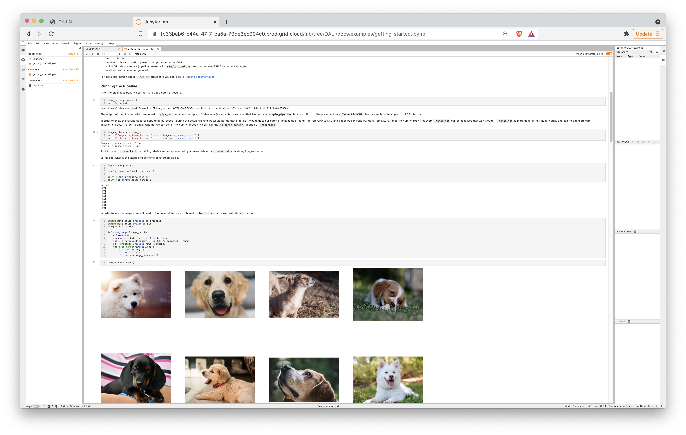
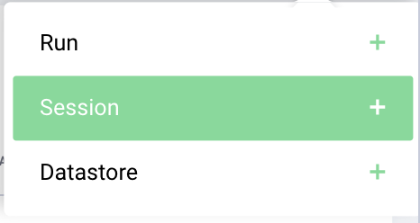
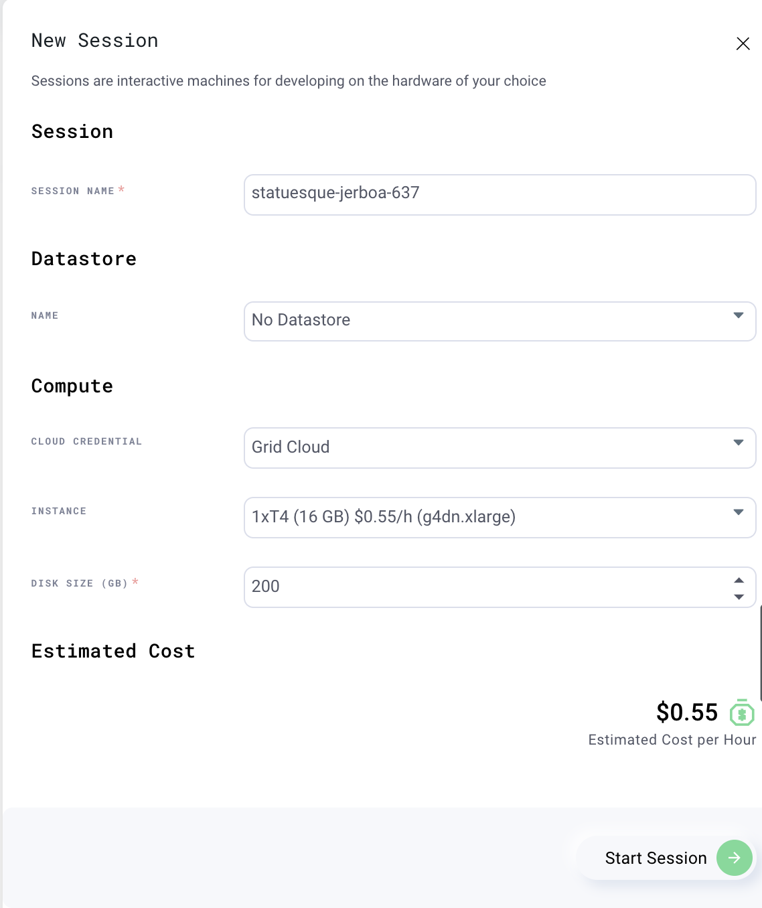
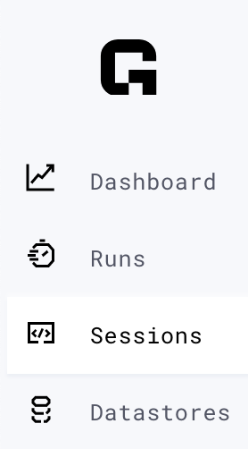

Grid.ai Session example running NVIDIA [DALI](https://github.com/NVIDIA/DALI) examples [getting_started.html](https://docs.nvidia.com/deeplearning/dali/user-guide/docs/examples/getting_started.html) and [video_reader_simple_example.ipynb](https://github.com/NVIDIA/DALI/blob/main/docs/examples/sequence_processing/video/video_reader_simple_example.ipynb).  A prerequisite, login into [Grid.ai](#start-a-gridai-g4dnxlarge--1-x-t4-session), start a Session with GPU instance, and [Start Jupyter Notebook](#start-a-jupyter-notebook). To run `bash` commands in this example, one of the following methods can be used: 
- From Grid.ai Jupyter Notebook: `File` -> `New` -> `Terminal`
- From Terminal: `grid session ssh`
- From VS Code: `Command P` -> `Remote SSH: Connect to Host`
  
# Check for CUDA library 
Run the following `bash` command(s)
```bash
ldconfig -p | grep libnvcuvid.so
# make sure ldconfig returns correctly with this
#        libnvcuvid.so.1 (libc6,x86-64) => /usr/lib/x86_64-linux-gnu/libnvcuvid.so.1
exit
```

# Download Tools 
Run the following `bash` command(s)

- install [`git-lfs`](https://git-lfs.github.com). Note: Git LFS is used there to download large videos from the used in `DALI_extra`. If git-lfs isn’t installed, then git cloned repository will be missing those files.

```bash
# Instructions from 
#   https://github.com/git-lfs/git-lfs/wiki/Installation#ubuntu and 
#   https://github.com/git-lfs/git-lfs/issues/3964#issuecomment-570586798
sudo apt-get install git-lfs
git lfs install --skip-repo
```

- install python tools and examples
```bash
pip3 install pip --upgrade && pip install --extra-index-url https://developer.download.nvidia.com/compute/redist --upgrade nvidia-dali-cuda110
# DALI examples
git clone https://github.com/NVIDIA/DALI
git clone https://github.com/NVIDIA/DALI_extra.git
```

- set DALI_EXTRA_PATH for python and Jupyter notebook scripts that need them

```bash
# for python scripts
cat >> ~/.bashrc <<EOF
export DALI_EXTRA_PATH="/home/jovyan/DALI_extra"
EOF
# for notebooks
ipython profile create
cat > ~/.ipython/profile_default/startup/oo-dali.py <<EOF
import os
os.environ['DALI_EXTRA_PATH'] = "/home/jovyan/DALI_extra"
EOF
# to see the list scripts that need DALI_EXTRA_PATH
grep -R --include *.ipynb --include *.py DALI_EXTRA ~/DALI
```

# Jupyter Notebook: Run getting_started.ipynb
Run the following from Jupyter Notebook UI.

- Click on `File` -> `Open From path` -> `/DALI/docs/examples/getting_started.ipynb`
- Click on `Run` -> `Run All Cells`

 

# Jupyter Notebook: Run getting_started.ipynb
Run the following from Jupyter Notebook UI.

- Click on `File` -> `Open From path` -> `/DALI/docs/examples/sequence_processing/video/video_reader_simple_example.ipynb`

- Click on `Run` -> `Run All Cells`


# Instructions on Starting Grid.ai Session and Jupyter Notebook

## Start a Grid.ai `g4dn.xlarge — 1 x T4` session

- Go to [https://grid.ai](https://grid.ai)
- Click on 
- Click on  
- Click on  
- Click on 

## Start a Jupyter notebook

- Click 
- Click on .
